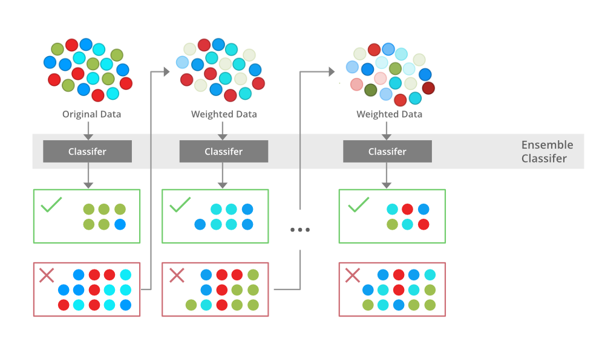

# Prediksi Depresi Menggunakan XGBoost dan Forward Neural Network ✈️ 🏢🏢 💥
Ardhika Yoga Pratama


## Project Overview 🌙
Proyek ini dikembangkan dengan tujuan untuk mendeteksi resiko depresi seseorang. Sistem ini dirancang untuk menganalisis berbagai faktor yang dapat memengaruhi kondisi mental seseorang, dengan ini diharapkan sistem dapat membantu institusi manapun terutama dibidang pendidikan dan mahasiswa itu sendiri dalam mendeteksi tanda-tanda awal masalah depresi sehingga dapat melakukan upaya pencegahan yang lebih awal. Ada 2 hal penting yang diperlukan dalam proyek kali ini yaitu:

- Dataset yang digunakan: [Student Depression Dataset](https://www.kaggle.com/datasets/hopesb/student-depression-dataset)
- Repository proyek: [Repo Sehat Dikit](https://github.com/Nvaraotr/UAP_ML)

## Algoritma Classification ⭐
### Feedforward Neural Network
Feedforward Neural Network (FNN) adalah jenis jaringan saraf tiruan dimana koneksi antara node tidak membentuk siklus. Karakteristik ini membedakannya dari recurrent neural networks (RNN). Jaringan ini terdiri dari input layer, satu atau lebih hidden layers, and an output layer. Informasi mengalir dalam satu arah-dari input ke output-maka dinamakan “feedforward”.


### XGBoost
XGBoost (eXtreme Gradient Boosting) adalah pustaka pembelajaran mesin open source terdistribusi yang menggunakan decision trees dengan peningkatan gradien, sebuah algoritma peningkatan pembelajaran terawasi yang memanfaatkan penurunan gradien. Algoritma ini dikenal dengan kecepatan, efisiensi, dan kemampuannya untuk menskalakan dengan baik dengan dataset yang besar.


## Preprocessing, EDA, and Modelling 🌍
### Preprocessing
Preprocessing dilakukan untuk menghapus null value, melakukan label encoding dan minmax encoding, serta mengelompokkan isi fitur "Degree" menjadi SMA, Sarjana, Magister, dan Doktor dan ditambahkan pada fitur baru bernama "Education Level"
### EDA


Dari grafik distribusi data di atas, dapat dilihat bahwa target data memiliki perbedaan yang tidak terlalu jauh sehingga data masih dapat dikatakan balance dan dapat dilanjutkan ke tahap selanjutnya.

### Modelling
#### FNN
```bash
model = Sequential([
    Dense(16, input_dim=x_train.shape[1], activation='relu'),
    Dense(8, activation='relu'),
    Dense(1, activation='sigmoid')
])
```


#### XGBoost
```bash
df_xgb = xgb.XGBClassifier()
df_xgb.fit(x_train, y_train)
df_xgb_pred = df_xgb.predict(x_test)
```


## Streamlit 💻
### Web UI

### Result UI

